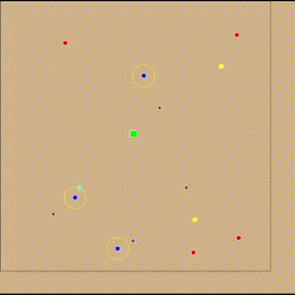

# FEUP-AIAD - Planet Explorer - Multi-Agent Simulation

## Description
A spaceship lands on a planet and sends:
* Explorers to find valuable resources
* Collectors to retrieve the resources
* Transporters to move the resources back to base

## Part 1 - Swing

First part in branch part1-swing uses agent framework 'jade' and 'swing' to visualize the simulation.

* Resources: Triangle, gray when undiscovered, cyan when discovered
* Base: Green box
* Explorers: Blue oval, with yellow oval representing range
* Collectors: Yellow oval
* Transporters: Oval, red when waiting, orange when in route to collector, purple when transporting resources

### Compiling
Compile Maven and disregard SSL Errors

`mvn clean install -Dmaven.wagon.http.ssl.insecure=true -Dmaven.wagon.http.ssl.allowall=true -Dmaven.wagon.http.ssl.ignore.validity.dates=true`
or run `build.sh` to build the project and run it.

For Windows:
`mvn clean install -D maven.wagon.http.ssl.insecure=true -D maven.wagon.http.ssl.allowall=true -D maven.wagon.http.ssl.ignore.validity.dates=true`

## Part 2 - Repast
Part 1 adapted to repast symphony.

### Members
Nuno Miguel Marques
Ricardo Araújo
Gonçalo Oliveira
